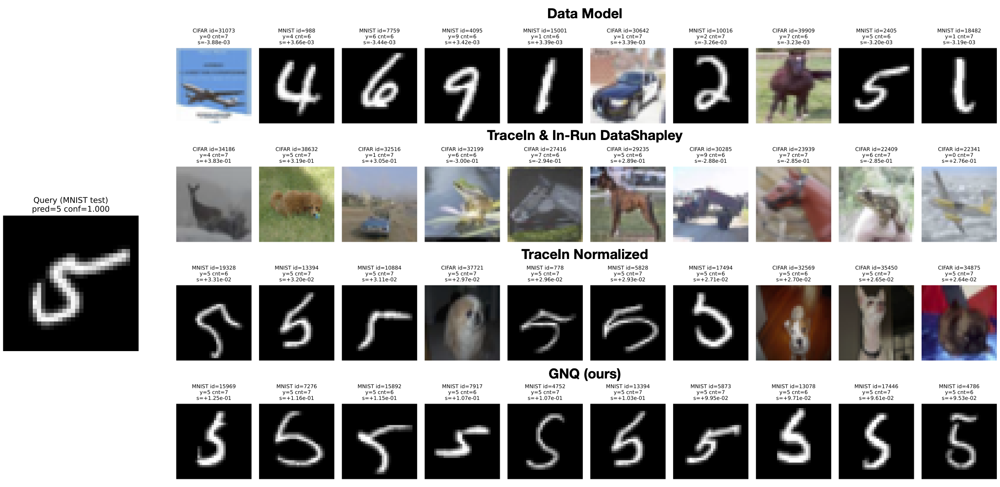

# Single-Trajectory Training Data Attribution via Gradient Uniqueness (GNQ)



**Official implementation** of **Single-Trajectory Training Data Attribution via Gradient Uniqueness (GNQ)** in a **single self-contained script**: `GNQ_mnist_cifar.py`.

- **Author:** Sleem Mahmoud Abdelghafar (Rice University)
- **Project category:** Training Data Attribution (Applied Interpretability)
- **Core idea:** explain *a specific deployed model run* (one stochastic training trajectory), not an average over retrainings.
- **Project Report:** [Google Doc draft](https://docs.google.com/document/d/12h39-84RqwcAVjveiShQxooQTL24gtAM6EJf3_M8UbQ/edit?usp=sharing)

---

## What is single-trajectory training data attribution?

Training Data Attribution (TDA) is often framed counterfactually:

> “How would the model’s behavior change if training point \(i\) were removed?”

That framing implicitly assumes training is deterministic. But modern training is fundamentally **stochastic**: even with the same dataset and code, changing only the random seed and/or the minibatch order can produce meaningfully different behaviors.

In deployment, the question practitioners often care about is:

> **Why does *this specific trained model we shipped* behave the way it does?**

This repo targets that question directly by defining attribution **along one realized training trajectory** (a single run), where the realized minibatch sequence is part of the causal pathway to the deployed parameters.

---

## What this repo demonstrates (in one picture)

This project uses a **mixed-domain stress test** (**MNIST + CIFAR10**) designed to amplify two common failure modes of dot-product-based attribution:

1) **Scale heterogeneity:** some gradients dominate purely by magnitude  
2) **Redundancy:** many per-example gradients “look alike” inside a minibatch

We compare four attribution rows (all answering the exact same fixed question for the same query and reward):

- **DataModel** (subset-level counterfactual baseline; averages away trajectory effects)
- **TraceIn & In-Run DataShapley** (raw dot-product alignment)
- **TraceIn Normalized** (renormalized dot product; reduces magnitude domination)
- **GNQ (ours)** (adds leave-one-out de-redundancy geometry via an inverse Gram matrix)

**Key takeaway:** In this mixed-domain setup, **GNQ is the only method that consistently surfaces query-aligned, class-consistent MNIST examples for an MNIST query** (see the top figure).

---

### Experimental setup (single-trajectory, mixed-domain test)

- **Task / model:** ResNet9 image classifier; standard cross-entropy training.
- **Training data:** D_mix = D_MNIST ∪ D_CIFAR with |D_MNIST| = |D_CIFAR| = 20,000.
- **Optimizer / hyperparameters:** Adam, learning rate = 1e-3, batch size B = 128, T = 2000 steps.
- **Model behavior (query reward):** For each digit class c ∈ {0,…,9}, fix one MNIST test image q_c and attribute training influence on a scalar reward R_c(θ). This scalar reward formulate any ML model's behavior that one might be interested to study (e.g. Memorization & Privacy Risks, LLM Misinformation ...etc)
- **Goal:** Rank individual training points by how much they contributed to changing R_c(θ) for the fixed query q_c during this one training run.

---

## Requirements

- Python 3.9+ recommended
- PyTorch + torchvision
- numpy, pillow, matplotlib (and whatever else the script imports)

---

## How to Run

```bash
python GNQ_mnist_cifar.py \
  --layers all \
  --steps 2000 \
  --ckpt_every 200 \
  --n_mnist 20000 \
  --n_cifar 20000 \
  --batch_size 128 \
  --lr 1e-3 \
  --queries_per_class 32 \
  --query_index 0 \
  --reward margin_mean_other \
  --lambda_reg 1e-2 \
  --alpha_center \
  --query_bs 8 \
  --query_cache_device cuda \
  --q_chunk 64 \
  --out_dir ./out_ggnq_vs_TraceIn_vs_NormTraceIn_vs_DataModel \
  --save_npz \
  --dm_runs 64 \
  --dm_steps 300 \
  --dm_p 0.3 \
  --dm_ridge 1e-2 \
  --topk 10 \
  --cf_topk 0 \
  --cf_max_total 1000 \
  --cf_random_per_class 0 \
  --cf_rank abs
